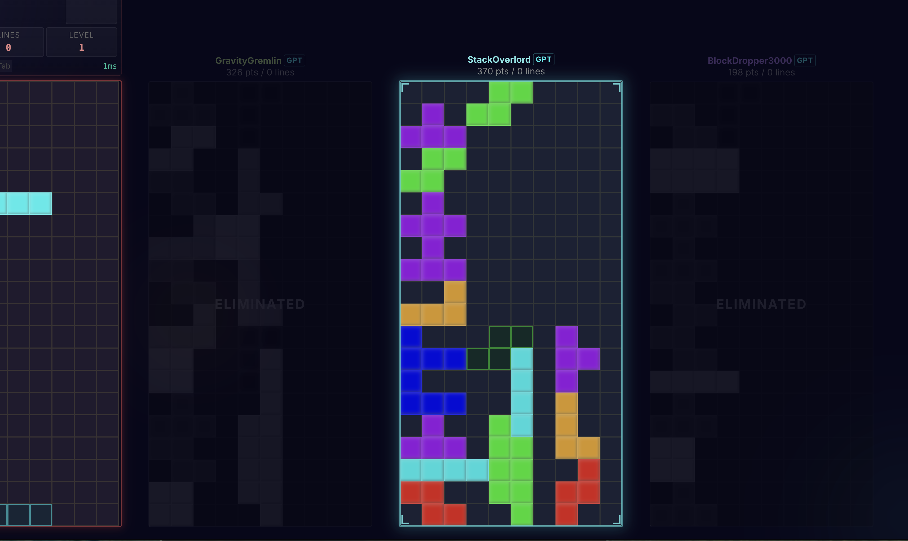

# Data Leakage Postmortem: Why TetrisGpt Piled Everything Left

> A case study in autoregressive model design — what went wrong, why,
> and the theory behind the fix.



## The Symptom

Three GPT bots in a 4-player battle. All three:
- Stacked pieces hard left (column 0-2)
- Cleared zero lines
- When the left column reached the top, shifted right and started a new pile
- Lost within seconds


The model had trained for 50 epochs with a final loss of **0.053** — suspiciously
low for a 110K parameter model learning Tetris strategy from scratch.

## The Root Cause: Data Leakage

The transformer model received the **placement** (the action it was supposed to
predict) as one of its own inputs.

```
Model inputs at position t:
  board_t          200-dim  (board state)
  current_piece_t    1-dim  (piece index)
  next_piece_t       1-dim  (piece index)
  battle_context_t   8-dim  (game context)
  placement_t        1-dim  <-- THE ANSWER

Target at position t:
  placement_t        1-dim  <-- SAME VALUE
```

With causal (autoregressive) masking, position `t` can attend to all positions
`0..t` — including itself. The model could directly read `placement_t` from its
own input and output it unchanged. It learned a near-identity function.

## Why the Loss Was So Low

A model that simply copies its input achieves near-zero loss on a classification
task. The 0.053 residual loss came from:
- Softmax approximation noise (log-prob of ~0.95 confidence is not exactly 0)
- Minor embedding/projection overhead
- The model wasn't a perfect identity — it routed through attention and FFN
  layers — but the signal was trivially available

For comparison, a model that actually has to *learn* Tetris strategy from board
states alone would realistically converge around **1.5–2.5** cross-entropy loss
on 40 placement classes (random baseline is `ln(40) = 3.69`).

## Why It Played Hard-Left

During inference, the current timestep doesn't have a known placement yet — it's
what we're trying to predict. The code used a placeholder:

```elixir
timestep = %{
  ...
  placement: %{rotation: 0, column: 0}  # placeholder
}
```

The model, having learned "copy the placement input", read this placeholder and
confidently predicted `placement_index(0, 0) = 0` — rotation 0, column 0.
Every piece went to the far left.

The occasional rightward shift happened when the valid-placement mask forced the
model away from column 0 (because the left side was full and the piece physically
couldn't fit there anymore).

## The Theory: Train-Test Distribution Shift

This is a textbook case of **distribution shift** caused by data leakage:

| | Training | Inference |
|---|---|---|
| `placement_t` input | Actual action taken | Placeholder `{0, 0}` |
| Model's job | Copy input (trivial) | Predict from board (impossible — never learned) |

The model never encountered the inference distribution during training. It had
no reason to learn the relationship between board state and good placements,
because a much easier signal (the literal answer) was always available.

### Connection to Teacher Forcing

This relates to a well-known problem in sequence models called **exposure bias**
or the **teacher forcing gap**:

- **Teacher forcing**: during training, feed the model the ground-truth previous
  tokens. This is standard and correct for autoregressive models (GPT, etc.).
- **The gap**: at inference time, the model sees its own (possibly wrong)
  predictions instead of ground truth.

In standard language models, this works because:
1. The model predicts token `t+1` from tokens `0..t` (shifted by one)
2. Token `t` is never used to predict itself

Our bug was worse than the teacher forcing gap. We fed token `t` as input and
asked the model to predict token `t`. There was no shift. The answer was directly
in the input at the same position.

## The Fix

Remove `placement` from the model's inputs entirely:

```
Model inputs at position t (after fix):
  board_t          200-dim
  current_piece_t    1-dim
  next_piece_t       1-dim
  battle_context_t   8-dim

Target at position t:
  placement_t        1-dim
```

The board at position `t` already encodes the cumulative result of all previous
placements (pieces land and stay on the board). The placement history is implicit
in the board evolution — adding it as an explicit input was both redundant and
dangerous.

### Why Not Shift Instead of Remove?

An alternative fix: feed `placement_{t-1}` at position `t` (standard
autoregressive shift). This would prevent direct leakage while preserving
action history.

We chose removal because:
1. **Simpler** — no off-by-one bookkeeping
2. **Board is sufficient** — the board already encodes action consequences
3. **Smaller model** — one fewer embedding matrix (~320 params saved, marginal
   but the model is tiny at 110K total)
4. **No exposure bias** — since there's no action input, there's no train/test
   gap on actions at all

For a larger model or one that needs to model opponent behavior (predicting what
placements *others* will make), the shifted approach would be worth revisiting.

## Diagnostic Checklist for Future Models

When training loss is suspiciously low, check:

1. **Is the target available in the input?** Directly (like here) or through
   a trivially derivable feature.
2. **Is there temporal leakage?** Does position `t` have access to information
   from the future (positions `t+1..T`)?
3. **Does the model need to learn anything hard?** If your 110K param model
   achieves loss comparable to a lookup table, something is wrong.
4. **Test with a scrambled baseline**: shuffle the targets randomly and retrain.
   If loss barely increases, the model isn't using the meaningful features.

## Expected Behavior After Fix

With the fix applied, the model must actually learn:
- Which board regions have holes and gaps
- How piece shapes interact with the current board surface
- When to prioritize line clears vs. flat stacking

Expected training metrics:
- Loss will be **much higher** (1.5–2.5 range is realistic)
- Training will be **slower** to converge
- But the model will **actually play Tetris** during inference

## References

- Bengio et al., "Scheduled Sampling for Sequence Prediction with Recurrent
  Neural Networks" (2015) — formalizes the teacher forcing gap
- Kaufmann et al., "A Survey of Reinforcement Learning Informed by Natural
  Language" (2023) — discusses action-in-input patterns for decision transformers
- Zheng et al., "Online Decision Transformer" (2022) — correct autoregressive
  formulation for game-playing transformers where actions are shifted by one
  position in the input sequence
