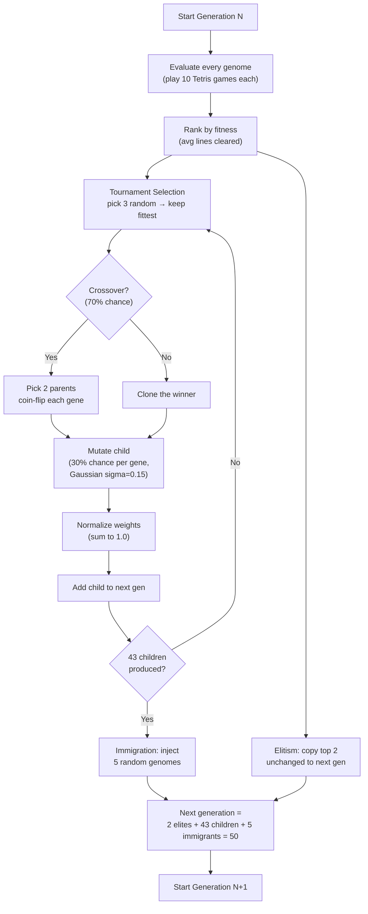
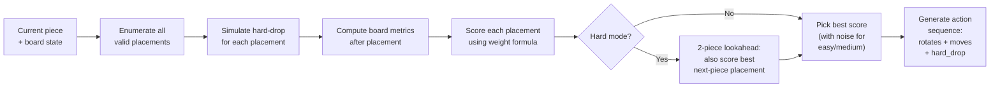
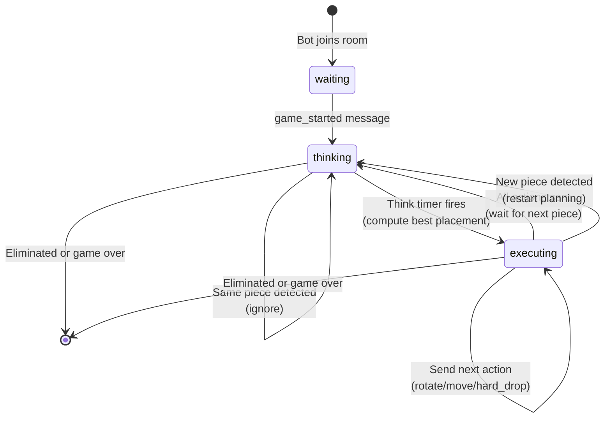
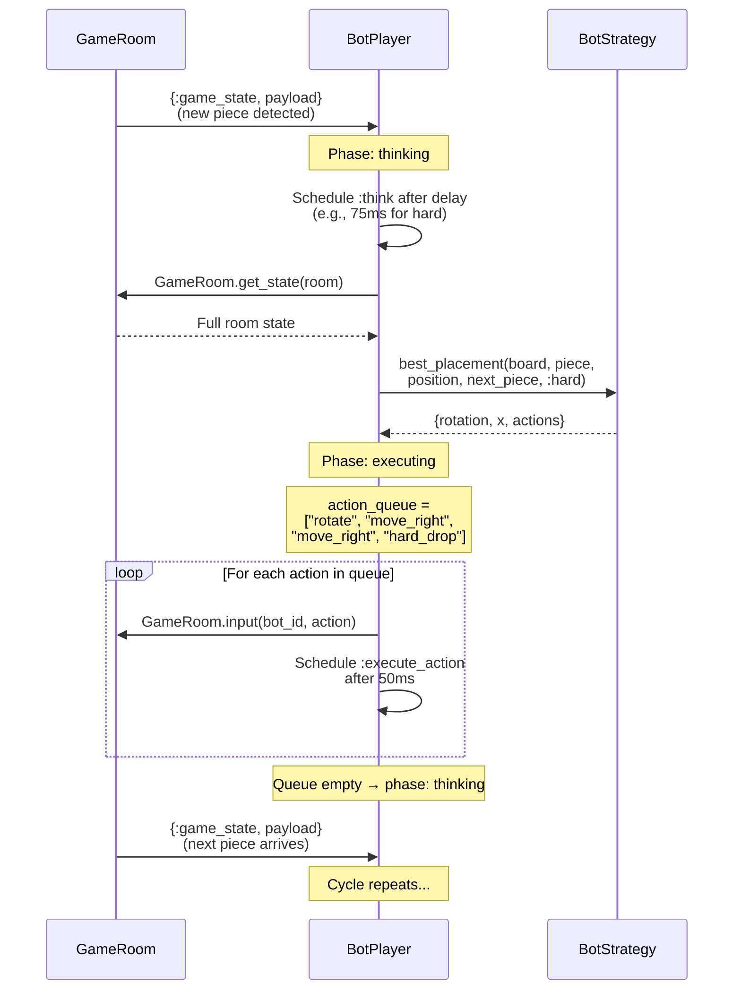
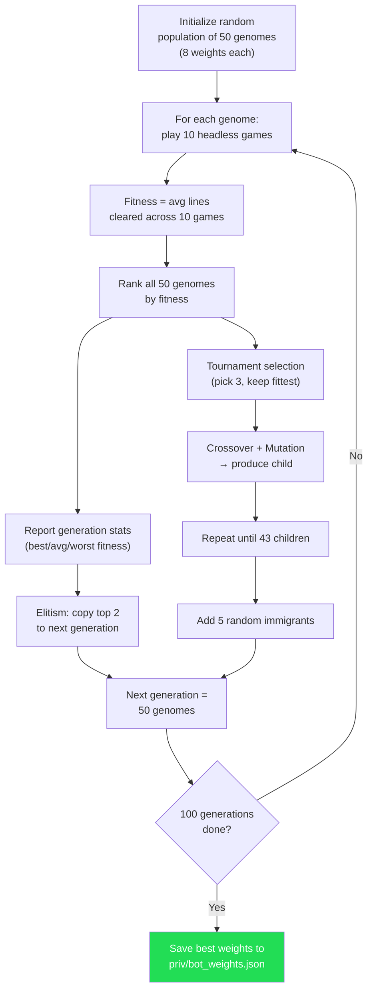
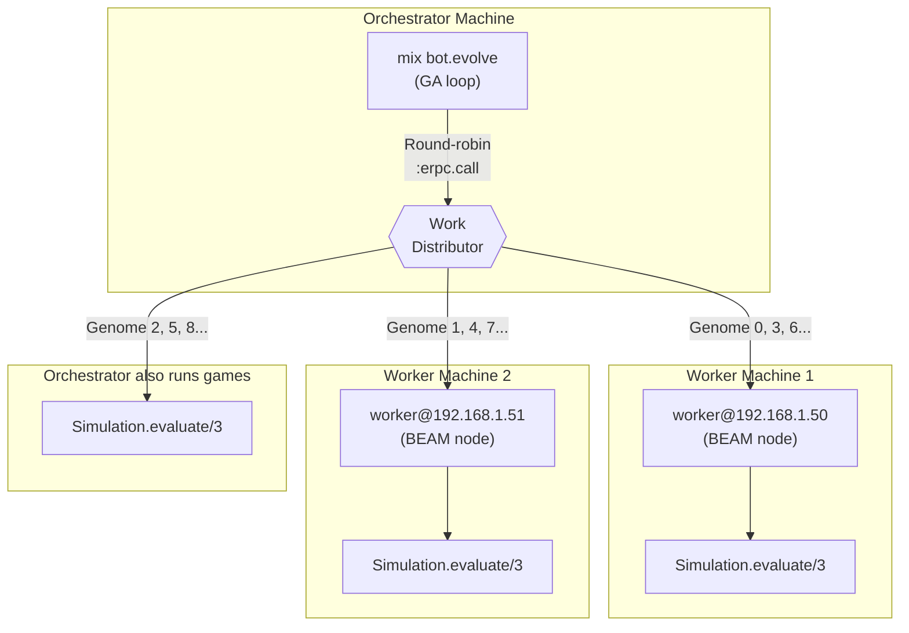
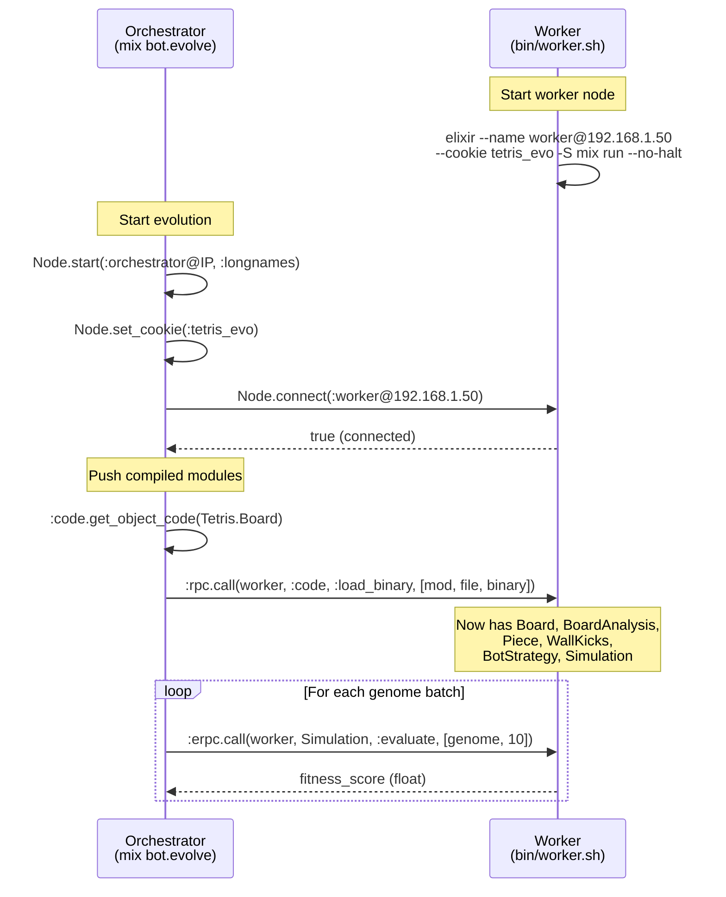

# Tetris Bot: From Genetics to Gameplay

A beginner-friendly walkthrough of how our Tetris bot learns to play — from the math behind genetic algorithms to distributed training across machines.

---

## Table of Contents

1. [What Is a Genetic Algorithm?](#part-1-what-is-a-genetic-algorithm)
2. [How the Bot Evaluates a Board](#part-2-how-the-bot-evaluates-a-board)
3. [How the Bot Picks Where to Place a Piece](#part-3-how-the-bot-picks-where-to-place-a-piece)
4. [How the Bot Plays in Real-Time](#part-4-how-the-bot-plays-in-real-time)
5. [How We Train the Bot](#part-5-how-we-train-the-bot)
6. [How We Distributed Training Across Machines](#part-6-how-we-distributed-training-across-machines)
7. [Appendix: Quick Reference](#appendix-quick-reference)

---

## Part 1: What Is a Genetic Algorithm?

Imagine you're breeding dogs. You start with a random group of dogs, pick the ones that are best at fetching, let them have puppies, and repeat for many generations. Eventually you get dogs that are incredible at fetching — even though nobody taught them how. That's a genetic algorithm (GA).

In our Tetris bot, we're "breeding" **weight vectors** — sets of numbers that tell the bot what matters when placing a Tetris piece. Solo mode uses 8 weights; battle mode uses 14 (the 8 solo weights plus 6 multiplayer interaction terms). Instead of dogs, we have bots. Instead of fetching, we measure how many lines they clear (solo) or how well they perform in 4-player battles.

### The Vocabulary

| Biology Term | Our Code Term | What It Means |
|---|---|---|
| Chromosome | `genome` (weight map) | A set of 8 (solo) or 14 (battle) numbers that defines a bot's "brain" |
| Gene | Single weight (e.g. `holes: 0.35`) | One number in the weight vector |
| Population | List of 50 genomes | The current group of bot brains |
| Fitness | Average lines cleared | How good a genome is at playing Tetris |
| Generation | One loop of evaluate→select→breed | One cycle of improvement |
| Selection | Tournament (pick 3, keep best) | How we choose parents |
| Crossover | Uniform (coin flip per gene) | How two parents make a child |
| Mutation | Gaussian noise (sigma=0.15) | Small random changes to keep diversity |
| Elitism | Top 2 survive unchanged | Insurance against losing the best solutions |
| Immigration | 5 random genomes per generation | Fresh blood to prevent stagnation |

### What's Inside a Genome?

A solo genome is a map of 8 weights. Each weight controls how much the bot cares about one aspect of the board:

```
┌─────────────────────────────────────────────────────────────────────────┐
│                    Example Solo Genome (8 weights)                      │
├─────────────────────┬───────────────────────────────────────────────────┤
│  height             │  0.0000  — "I don't care about total height"     │
│  holes              │  0.3546  — "I really hate holes"                 │
│  bumpiness          │  0.0849  — "I slightly prefer flat surfaces"     │
│  lines              │  0.3763  — "I love clearing lines"               │
│  max_height         │  0.0000  — "Tallest column? Doesn't matter"      │
│  wells              │  0.1841  — "Avoid deep wells"                    │
│  row_transitions    │  0.0001  — "Smooth rows are slightly better"     │
│  column_transitions │  0.0000  — "Column roughness? Not a priority"    │
└─────────────────────┴───────────────────────────────────────────────────┘
  Solo weights are normalized so they sum to 1.0
```

Battle genomes add 6 multiplayer interaction terms (14 weights total, not normalized):

```
┌─────────────────────────────────────────────────────────────────────────┐
│            Additional Battle Weights (6 interaction terms)              │
├─────────────────────┬───────────────────────────────────────────────────┤
│  garbage_pressure   │  0.20  — "Be cautious when garbage is incoming"  │
│  attack_bonus       │  0.15  — "Send garbage when opponents are tall"  │
│  danger_aggression  │  0.10  — "Clear lines when opponents are dying"  │
│  survival_height    │  0.15  — "Play safe when my board is high"       │
│  tetris_bonus       │  0.10  — "Bonus for 4-line clears"              │
│  line_efficiency    │  0.05  — "Multi-line clears are quadratically   │
│                     │          better"                                  │
└─────────────────────┴───────────────────────────────────────────────────┘
  Battle weights are clamped to [0.0, 2.0] independently
```

### How One Generation Works



### Crossover: Making a Child from Two Parents

When two parent genomes are selected, each gene in the child is randomly taken from one parent or the other (50/50 coin flip):

```
Parent A:   height=0.12  holes=0.35  bumpy=0.08  lines=0.25  max_h=0.10  wells=0.10  row_t=0.05  col_t=0.03
               ↓            ↓           ↓           ↓            ↓           ↓           ↓           ↓
Coin flip:     A             B           A           B            A           B           A           B
               ↓            ↓           ↓           ↓            ↓           ↓           ↓           ↓
Child:      height=0.12  holes=??    bumpy=0.08  lines=??     max_h=0.10  wells=??    row_t=0.05  col_t=??

Parent B:   height=0.05  holes=0.42  bumpy=0.15  lines=0.18  max_h=0.05  wells=0.15  row_t=0.02  col_t=0.08
```

After crossover, mutation adds small Gaussian noise to each gene (with 30% probability per gene). Solo weights are then normalized to sum to 1.0. Battle weights are clamped to [0.0, 2.0] without normalization.

---

## Part 2: How the Bot Evaluates a Board

Before the bot can decide where to place a piece, it needs a way to judge how "good" a board looks. We measure 8 properties of every board state.

> **Code reference:** `Tetris.BoardAnalysis.evaluate/1` in `lib/tetris/board_analysis.ex:27`

### The 8 Board Metrics

#### 1. Aggregate Height — sum of all column heights

```
Column:    0  1  2  3  4  5  6  7  8  9
           .  .  .  .  .  .  .  .  .  .     ← row 0 (top)
           .  .  .  .  .  .  .  .  .  .
           .  .  .  .  .  .  .  .  .  .
           .  .  .  .  .  .  .  .  .  .
           .  .  .  .  .  .  .  .  .  .
           .  .  .  .  .  .  .  .  .  .
           .  .  .  .  .  .  .  .  .  .
           .  .  .  .  .  .  .  .  .  .
           .  .  .  .  .  .  .  .  .  .
           .  .  .  .  .  .  .  .  .  .
           .  .  .  .  .  .  .  .  .  .
           .  .  .  .  .  .  .  .  .  .
           .  .  .  .  .  .  .  .  .  .
           .  .  .  .  .  .  .  .  .  .
           .  .  .  .  .  .  .  .  .  .
           .  .  .  ■  .  .  .  .  .  .
           .  .  ■  ■  .  .  .  .  .  .
           .  ■  ■  ■  ■  .  .  .  .  .
           ■  ■  ■  ■  ■  ■  .  .  .  ■
           ■  ■  ■  ■  ■  ■  ■  .  ■  ■     ← row 19 (bottom)
          ─────────────────────────────────
Height:    2  3  3  5  3  2  1  0  2  2  = 23

aggregate_height = 23
```

**Lower is better.** A tall board is closer to death.

#### 2. Holes — empty cells trapped under filled cells

```
           .  .  .  .  .
           .  .  ■  .  .     ← top of column 2
           .  .  .  .  .     ← HOLE (empty, but has ■ above)
           .  ■  ■  ■  .
           ■  ■  .  ■  ■     ← HOLE in column 2
                  ▲
              2 holes in column 2
```

**Lower is better.** Holes are nearly impossible to clear without stacking more.

#### 3. Bumpiness — sum of absolute height differences between adjacent columns

```
Heights:  2  3  3  5  3  2  1  0  2  2

Diffs:     |2-3| + |3-3| + |3-5| + |5-3| + |3-2| + |2-1| + |1-0| + |0-2| + |2-2|
         =   1   +   0   +   2   +   2   +   1   +   1   +   1   +   2   +   0
         =   10

bumpiness = 10
```

**Lower is better.** A flat surface accepts more piece types.

#### 4. Complete Lines — full rows that will be cleared

```
           .  .  ■  ■  ■  ■  ■  ■  ■  ■     ← 1 empty cell, NOT complete
           ■  ■  ■  ■  ■  ■  ■  ■  ■  ■     ← COMPLETE ✓
           ■  ■  ■  ■  ■  ■  ■  ■  ■  ■     ← COMPLETE ✓
           ■  ■  ■  .  ■  ■  ■  ■  ■  ■     ← 1 empty cell, NOT complete

complete_lines = 2
```

**Higher is better.** Clearing lines is the whole point of Tetris.

#### 5. Max Height — tallest column

```
Heights:  2  3  3  5  3  2  1  0  2  2
                      ▲
                  tallest = 5

max_height = 5
```

**Lower is better.** A tall column risks game over.

#### 6. Well Sum — total depth of "wells" (gaps between tall neighbors)

A well is a column that's shorter than both its neighbors. Wall edges count as height 20.

```
Heights:  5  2  5

Column 1 has height 2, neighbors have heights 5 and 5.
Well depth = min(5, 5) - 2 = 3

           ■  .  ■
           ■  .  ■       ← well depth = 3
           ■  .  ■
           ■  ■  ■
           ■  ■  ■
```

**Lower is better.** Deep wells are hard to fill without I-pieces.

#### 7. Row Transitions — fill-state changes along each row

For each row, count adjacent cell pairs where the fill state differs (filled vs. empty). Board edges count as filled.

```
Row:     edge ■ ■ ■ . . ■ ■ . ■ ■ edge
                      ↑ ↑     ↑ ↑
              filled→empty  empty→filled  (4 transitions in this row)

Empty row:  edge . . . . . . . . . . edge  → 2 transitions (edge→empty, empty→edge)
Full row:   edge ■ ■ ■ ■ ■ ■ ■ ■ ■ ■ edge  → 0 transitions
```

**Lower is better.** Fewer transitions means the board surface is smoother with fewer fragmented gaps.

#### 8. Column Transitions — fill-state changes along each column

Same concept vertically. Ceiling counts as empty, floor counts as filled.

```
Column (top to bottom):
    ceiling (empty)
    .  (empty)       → 0 transitions (same)
    .  (empty)       → 0
    ■  (filled)      → 1 transition (empty→filled)
    .  (empty)       → 1 transition (filled→empty = hole!)
    ■  (filled)      → 1 transition (empty→filled)
    ■  (filled)      → 0
    floor (filled)   → 0
                       Total: 3 transitions
```

**Lower is better.** Column transitions detect buried holes — each hole creates at least 2 transitions.

### The Scoring Formula

The bot combines these 8 metrics into a single score using weighted sums:

```
score = - weight_height             × aggregate_height
        - weight_holes              × holes
        - weight_bumpiness          × bumpiness
        + weight_lines              × complete_lines
        - weight_max_height         × max_height
        - weight_wells              × well_sum
        - weight_row_transitions    × row_transitions
        - weight_column_transitions × column_transitions
```

Notice: **lines cleared is positive** (good), everything else is **negative** (bad). The bot maximizes this score.

In **battle mode**, 6 additional interaction terms are added that use both post-placement board state and multiplayer context (garbage pending, opponent heights). See `score_battle_terms/3` for details.

> **Code reference:** `Tetris.BotStrategy.score_placement/2` in `lib/tetris/bot_strategy.ex:182`

### Worked Example

Given this board state after placing a piece:

| Metric | Value |
|---|---|
| aggregate_height | 23 |
| holes | 2 |
| bumpiness | 10 |
| complete_lines | 1 |
| max_height | 5 |
| well_sum | 3 |

Using our evolved weights from `priv/bot_weights.json`:

| Weight | Value |
|---|---|
| height | 0.0000 |
| holes | 0.3546 |
| bumpiness | 0.0849 |
| lines | 0.3763 |
| max_height | 0.0000 |
| wells | 0.1841 |

```
score = -(0.0000 × 23)        aggregate_height contribution:   0.0000
        -(0.3546 × 2)         holes contribution:             -0.7092
        -(0.0849 × 10)        bumpiness contribution:         -0.8490
        +(0.3763 × 1)         lines contribution:             +0.3763
        -(0.0000 × 5)         max_height contribution:         0.0000
        -(0.1841 × 3)         wells contribution:             -0.5523
       ─────────────────
       = -1.7342
```

The bot computes this score for every possible placement and picks the highest one.

---

## Part 3: How the Bot Picks Where to Place a Piece

Given a board and a piece, the bot must decide: **which rotation and which column?** It does this by trying every possibility and picking the best.

> **Code reference:** `Tetris.BotStrategy.best_placement/5` in `lib/tetris/bot_strategy.ex:63`

### Step-by-Step Placement Search



### Enumeration: All Valid Placements

For each piece, the bot tries all 4 rotations and all valid x positions. A T-piece on an empty board produces about 34 options:

| Rotation | Valid X positions | Count |
|---|---|---|
| 0 (spawn) | 0, 1, 2, 3, 4, 5, 6, 7 | 8 |
| 1 (90° CW) | 0, 1, 2, 3, 4, 5, 6, 7, 8 | 9 |
| 2 (180°) | 0, 1, 2, 3, 4, 5, 6, 7 | 8 |
| 3 (270° CW) | 0, 1, 2, 3, 4, 5, 6, 7, 8 | 9 |
| **Total** | | **34** |

For each valid (rotation, x) pair, the bot:

1. Rotates the piece `rotation_count` times
2. Finds the ghost position (hard-drop destination) via `Board.ghost_position/3`
3. Places the piece on the board via `Board.place_piece/4`
4. Clears any complete lines via `Board.clear_lines/1`
5. Evaluates the resulting board via `BoardAnalysis.evaluate/1`

> **Code reference:** `Tetris.BotStrategy.enumerate_placements/2` in `lib/tetris/bot_strategy.ex:135`

### Example: Scoring 4 Placements

Suppose we have an L-piece and these are 4 of the ~34 possible placements:

| # | Rotation | X | agg_height | holes | bumpy | lines | Score |
|---|---|---|---|---|---|---|---|
| 1 | 0 | 0 | 18 | 0 | 6 | 0 | -0.509 |
| 2 | 0 | 3 | 18 | 0 | 4 | 1 | -0.263 |
| 3 | 1 | 7 | 20 | 1 | 8 | 0 | -1.033 |
| 4 | 2 | 5 | 16 | 0 | 3 | 2 | +0.244 |

The bot picks placement **#4** (rotation=2, x=5) because it scores highest: it clears 2 lines and leaves the board flat.

### Hard Mode: 2-Piece Lookahead

On hard difficulty, the bot doesn't just score the current placement — it also considers what happens with the **next piece**:

```
For each placement of current piece:
    score_current = score(board_after_placement)
    For each placement of next piece on board_after_placement:
        score_next = score(board_after_next_placement)
    combined = score_current + max(all score_next values)
Pick the placement with the best combined score.
```

This is like a chess player thinking 2 moves ahead. The pruned version (used in training) only evaluates the top 5 current placements for lookahead, reducing evaluations from ~1,156 to ~204 per move.

> **Code reference:** `Tetris.BotStrategy.score_with_lookahead/3` in `lib/tetris/bot_strategy.ex:163`

### Action Planning

Once the best placement is chosen (say rotation=2, x=5, piece spawns at x=3):

```
1. Rotate twice:       ["rotate", "rotate"]
2. Move right twice:   ["move_right", "move_right"]     (5 - 3 = 2)
3. Hard drop:          ["hard_drop"]

Final sequence: ["rotate", "rotate", "move_right", "move_right", "hard_drop"]
```

> **Code reference:** `Tetris.BotStrategy.plan_actions/3` in `lib/tetris/bot_strategy.ex:113`

### Difficulty Comparison

| Setting | Think Delay | Action Interval | Noise | Lookahead | Targeting |
|---|---|---|---|---|---|
| Easy | 800–1200ms | 200ms | 20% random | No | Random opponent |
| Medium | 300–500ms | 100ms | 5% random | No | Random opponent |
| Hard | 50–100ms | 50ms | None | 2-piece | Highest-scoring opponent |

**Noise** means: with some probability, the bot picks a random placement from the top half instead of the absolute best. This makes easy/medium bots feel more human.

---

## Part 4: How the Bot Plays in Real-Time

The bot runs as a GenServer (`BotPlayer`) that participates in a game room just like a human player. It receives game state broadcasts and sends back input actions.

> **Code reference:** `TetrisGame.BotPlayer` in `lib/tetris_game/bot_player.ex`

### State Machine



### The 3 Phases

**1. Waiting** — The bot has joined a room but the game hasn't started. It ignores all game state broadcasts.

**2. Thinking** — A new piece has appeared. The bot waits a human-like delay (50–1200ms depending on difficulty), then calls `BotStrategy.best_placement/5` to compute the optimal action sequence.

**3. Executing** — The bot has a queue of actions (e.g., `["rotate", "move_right", "hard_drop"]`). It sends them one at a time with paced intervals (50–200ms) to simulate human-like key presses.

### Timing by Difficulty

| Difficulty | Think Delay | Action Interval | Feels Like |
|---|---|---|---|
| Easy | 800–1200ms | 200ms per action | Casual player |
| Medium | 300–500ms | 100ms per action | Experienced player |
| Hard | 50–100ms | 50ms per action | Machine speed |

### Sequence: One Piece Lifecycle



### Timeline: Hard-Mode Piece Placement

```
Time (ms)   Event
─────────────────────────────────────────────
     0      GameRoom broadcasts game_state (new piece)
    75      Think timer fires → compute best_placement (~2ms)
    77      Phase → executing, queue = [rotate, move_right, move_right, hard_drop]
    77      Send "rotate" to GameRoom
   127      Send "move_right" to GameRoom
   177      Send "move_right" to GameRoom
   227      Send "hard_drop" to GameRoom
   227      Queue empty → phase = thinking, waiting for next piece
   250      GameRoom tick → broadcasts new game_state with next piece
─────────────────────────────────────────────
   Total: ~250ms from piece spawn to piece locked
```

### Smart Targeting

On hard difficulty, the bot targets the opponent with the highest score (the biggest threat). Easy/medium bots pick a random alive opponent.

> **Code reference:** `TetrisGame.BotPlayer.maybe_set_target/3` in `lib/tetris_game/bot_player.ex:186`

---

## Part 5: How We Train the Bot

This is where Parts 1–3 come together. The genetic algorithm needs to **evaluate how good each genome is**, which means playing full Tetris games with each weight vector and measuring lines cleared.

### Simulation: Headless Tetris

Training doesn't use the real game server. Instead, `BotTrainer.Simulation` plays games directly:

- No GenServers, no timers, no network
- Pieces are placed instantly (no gravity ticks)
- Games run ~1000x faster than real-time
- Each game plays until the bot can't place a piece (game over)

> **Code reference:** `BotTrainer.Simulation.play_game/2` in `lib/bot_trainer/simulation.ex:31`

### The Simulation Loop

```elixir
# Pseudocode of what happens inside Simulation.play_game/2:

state = {empty board, random piece, random next_piece, score=0}

loop:
    placements = enumerate_all_valid_placements(state.board, state.piece)
    if no valid placements → GAME OVER, return lines_cleared

    best = pick_best_placement(placements, next_piece, weights)
    state = apply_placement(state, best)    # place piece, clear lines
    state = {board, next_piece, new_random_piece, updated_score}
```

### Full Evolution Pipeline



### Before and After: Evolution in Action

Data from an actual training run (30 genomes, 100 generations, 30 games each):

**Generation 1** — Random weights, the bot barely plays:

```
Best genome:   height=0.17  holes=0.14  bumpy=0.03  lines=0.23  max_h=0.23  wells=0.21
Best fitness:  66.3 lines/game
Avg fitness:   46.5 lines/game
```

**Generation 14** — Some structure emerging, holes/wells becoming dominant:

```
Best genome:   height=0.07  holes=0.43  bumpy=0.11  lines=0.14  max_h=0.00  wells=0.25
Best fitness:  106.7 lines/game
Avg fitness:   59.9 lines/game
```

**Final evolved weights** (from `priv/bot_weights.json`):

```
Best genome:   height=0.00  holes=0.35  bumpy=0.08  lines=0.38  max_h=0.00  wells=0.18
Best fitness:  149.5 lines/game
```

### Interpreting the Evolved Weights

| Weight | Evolved Value | Interpretation |
|---|---|---|
| `height` | **0.0000** | Total height doesn't matter — what matters is how it's distributed |
| `holes` | **0.3546** | Avoiding holes is the #1 priority (35% of decision) |
| `bumpiness` | **0.0849** | Slight preference for flat surfaces |
| `lines` | **0.3763** | Clearing lines is almost as important as avoiding holes (38%) |
| `max_height` | **0.0000** | Tallest column doesn't matter on its own |
| `wells` | **0.1841** | Avoid deep wells — they're traps (18%) |

The evolution discovered that **holes and line clears dominate**. A bot that avoids creating holes and aggressively clears lines survives far longer than one that just tries to keep the board flat. The aggregate height and max height weights dropped to zero because holes and wells already capture the dangerous aspects of a tall board.

### Fitness Progression

```
Lines/game
  150 |                                                        ****
  135 |                                            ****    ****
  120 |                                   *    ****    ****
  105 |                          *    ** ** ****
   90 |                *    ** **  ***
   75 |        ** *  ***  **
   60 | ....*..*..*..*..*..........*...*.....*...*...........*....
   45 | *.**..
   30 |
   15 |
    0 +------------------------------------------------------------
      Gen 1         20         40         60         80        100
              **** Best    .... Average
```

> **Code reference:** `BotTrainer.Evolution.evolve/2` in `lib/bot_trainer/evolution.ex:115`

---

## Part 6: How We Distributed Training Across Machines

Training is CPU-intensive: 50 genomes x 10 games x 100 generations = **50,000 full Tetris games**. Each game places hundreds of pieces, and each piece evaluates ~34 placements with potential lookahead. The BEAM (Erlang VM) makes distributing this work across machines straightforward.

### Architecture



### How Distribution Works

The BEAM (Erlang VM) has built-in support for connecting multiple machines into a cluster. Each machine runs a BEAM "node" identified by `name@ip`. Nodes that share the same "cookie" (a shared secret string) can call functions on each other as if they were local.

> **Code reference:** `BotTrainer.Cluster` in `lib/bot_trainer/cluster.ex`

### Connection Sequence



### Module Push

Workers don't need the source code. The orchestrator compiles everything locally, then sends the compiled BEAM bytecode to each worker:

```
Modules pushed to workers:
├── Tetris.Board           — board manipulation
├── Tetris.BoardAnalysis   — heuristic metrics
├── Tetris.Piece           — piece definitions & rotation
├── Tetris.WallKicks       — SRS wall kick data
├── Tetris.BotStrategy     — placement enumeration & scoring
└── BotTrainer.Simulation  — headless game loop
```

> **Code reference:** `BotTrainer.Cluster.push_modules/1` in `lib/bot_trainer/cluster.ex:87`

### Work Distribution

Genomes are distributed round-robin across all available nodes (including the orchestrator itself):

```elixir
# From Evolution.evaluate_population/4
nodes = Cluster.available_nodes()     # [orchestrator@IP, worker1@IP, worker2@IP]

genomes
|> Enum.with_index()
|> Task.async_stream(fn {genome, idx} ->
    target = Enum.at(nodes, rem(idx, length(nodes)))   # round-robin
    :erpc.call(target, Simulation, :evaluate, [genome, games_per_genome])
end, max_concurrency: max_concurrency)
```

With 3 nodes and 50 genomes: node 0 gets genomes 0,3,6,... node 1 gets 1,4,7,... node 2 gets 2,5,8,...

### Starting a Worker

On each worker machine, from the project directory:

```bash
./bin/worker.sh 192.168.1.50
# or with a custom cookie:
./bin/worker.sh 192.168.1.50 my_secret_cookie
```

This starts a BEAM node named `worker@192.168.1.50` and waits for the orchestrator to connect.

### Running Distributed Evolution

On the orchestrator machine:

```bash
mix bot.evolve \
  --workers worker@192.168.1.50,worker@192.168.1.51 \
  --cookie tetris_evo \
  --population 50 \
  --generations 100 \
  --games 10
```

The orchestrator auto-detects its LAN IP, starts Erlang distribution, connects to workers, pushes modules, and begins the evolution loop.

---

## Appendix: Quick Reference

### CLI Commands

```bash
# Solo evolution (8 weights, uses all CPU cores)
mix bot.evolve

# Solo with full options
mix bot.evolve \
  --population 50    # -p  Population size (default: 50)
  --generations 100  # -g  Number of generations (default: 100)
  --games 10         # -n  Games per genome (default: 10)
  --concurrency 8    # -c  Max parallel evaluations (default: all cores)
  --output path.json # -o  Output file (default: priv/bot_weights.json)
  --log path.csv     #     CSV log (default: priv/bot_evolution_log.csv)
  --tournament 3     #     Tournament size (default: 3)
  --mutation-rate 0.3  #   Mutation probability per gene (default: 0.3)
  --mutation-sigma 0.15 #  Gaussian std dev (default: 0.15)
  --crossover-rate 0.7  #  Crossover probability (default: 0.7)
  --elitism 2        #     Elites kept per generation (default: 2)
  --immigrants 5     #     Random genomes per generation (default: 5)

# Battle evolution (14 weights)
mix bot.evolve.battle
mix bot.evolve.battle --population 30 --generations 15 --battles 20

# Distributed evolution (solo or battle)
mix bot.evolve \
  --workers worker@192.168.1.50,worker@192.168.1.51 \  # -w
  --cookie tetris_evo

# Start a worker node
./bin/worker.sh <ip-or-hostname> [cookie]
```

### File Map

| File | Role |
|---|---|
| `lib/tetris/board_analysis.ex` | Computes 8 heuristic metrics from a board |
| `lib/tetris/bot_strategy.ex` | Enumerates placements, scores them (solo 8-weight + battle 14-weight), plans actions |
| `lib/tetris_game/bot_player.ex` | Real-time bot GenServer (waiting/thinking/executing) |
| `lib/bot_trainer/simulation.ex` | Headless solo game loop for fast evaluation |
| `lib/bot_trainer/battle_simulation.ex` | Headless 4-player battle simulation |
| `lib/bot_trainer/evolution.ex` | Genetic algorithm: selection, crossover, mutation (solo + battle) |
| `lib/bot_trainer/cluster.ex` | Erlang distribution: connect workers, push modules |
| `lib/mix/tasks/bot.evolve.ex` | Solo evolution CLI (8 weights) |
| `lib/mix/tasks/bot.evolve.battle.ex` | Battle evolution CLI (14 weights) |
| `bin/worker.sh` | Shell script to start a worker BEAM node |
| `priv/bot_weights.json` | Evolved solo weights loaded by hard-mode bots |
| `priv/bot_evolution_log.csv` | Solo evolution CSV log |
| `priv/battle_weights.json` | Evolved battle weights loaded by battle-mode bots |
| `priv/battle_evolution_log.csv` | Battle evolution CSV log |

### Glossary

| Term | Definition |
|---|---|
| **Genome** | A map of 8 weights (solo: `height`, `holes`, `bumpiness`, `lines`, `max_height`, `wells`, `row_transitions`, `column_transitions`) or 14 weights (battle: + `garbage_pressure`, `attack_bonus`, `danger_aggression`, `survival_height`, `tetris_bonus`, `line_efficiency`) |
| **Fitness** | Solo: average lines cleared. Battle: composite score from placement, survival, lines cleared, and garbage sent |
| **Generation** | One cycle of: evaluate all genomes → select → breed → next population |
| **Tournament selection** | Pick k random genomes, keep the fittest |
| **Uniform crossover** | Each gene randomly from parent A or B (50/50 coin flip) |
| **Gaussian mutation** | Add `normal(0, sigma)` noise to a gene, clamped to [0, 1] (solo) or [0, 2] (battle) |
| **Elitism** | Top N genomes copied unchanged to next generation |
| **Immigration** | N random genomes added each generation to maintain diversity |
| **Lookahead** | Evaluating placements for both current and next piece |
| **Noise** | Probability of picking a suboptimal placement (easy/medium difficulty) |
| **EPMD** | Erlang Port Mapper Daemon — helps BEAM nodes find each other on a network |
| **Cookie** | Shared secret string that authorizes BEAM nodes to connect |
| **`:erpc.call`** | Remote procedure call — run a function on another BEAM node |
